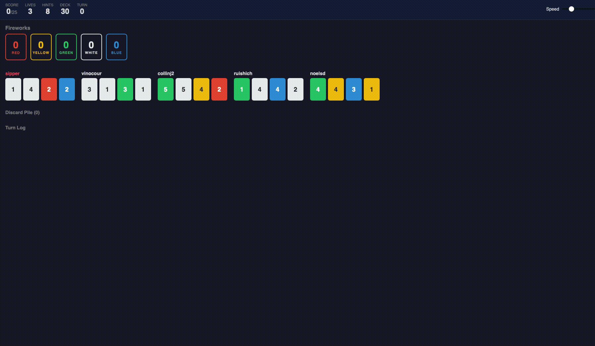

# Hanabi LLM Agent Viewer

A web-based simulation of **Hanabi** — the cooperative card game — where LLM-powered agents with unique student personas collaborate to build fireworks. Built for Stanford CS 222.



## Overview

In Hanabi, players cooperate to play cards in the correct order across five colored suits, but **you can't see your own cards** — only your teammates' cards. Communication happens through limited hint tokens.

This project takes that concept further: each AI agent is powered by an LLM (GPT-4o or Claude) and assigned a **real personality profile** sourced from student survey data. An analytical INTJ will play differently from a social ENFJ — risk tolerance, hint-giving patterns, and strategic priorities all shift based on who's "at the table."

### Key Features

- **Pure Python Hanabi engine** — no external C++ dependencies, fully self-contained
- **Persona-driven agents** — 30+ personality dimensions from MBTI type to decision-making style
- **Dual LLM support** — works with both OpenAI (GPT-4o) and Anthropic (Claude) APIs
- **Real-time spectator view** — watch games unfold turn-by-turn in the browser via SSE streaming
- **Expandable reasoning** — click any turn in the log to see the full LLM thought process
- **Color-coded cards** — Red, Yellow, Green, White, Blue with hint indicators

## Quick Start

### 1. Clone & install

```bash
git clone <repo-url>
cd cs222-hanabi
python3 -m venv .venv
source .venv/bin/activate
pip install -r requirements.txt
```

### 2. Configure API key

```bash
cp .env.example .env
```

Edit `.env` and add your API key:

```env
OPENAI_API_KEY=sk-...
# or
ANTHROPIC_API_KEY=sk-ant-...
LLM_PROVIDER=openai  # or "anthropic"
```

### 3. Run

```bash
python app.py
```

Open **http://localhost:5001** in your browser, pick the number of players, and hit **Start Game**.

## How It Works

### Game Engine (`hanabi_engine.py`)

A complete Hanabi implementation with:
- Standard 50-card deck (5 colors x ranks 1-5, with 3/2/2/2/1 distribution)
- Full game rules: play, discard, hint (color or rank), life/info token management
- Observation system that hides each player's own hand (just like the real game)
- End conditions: 0 lives, empty deck + final round, or perfect 25

Run standalone to verify:

```bash
python hanabi_engine.py
# Runs 5 test games with random agents
```

### Agent System (`agents.py`)

Each `HanabiLLMAgent` has:

| Component | What it does |
|---|---|
| **Persona** | Natural-language personality derived from survey data (age, MBTI, values, decision style, etc.) |
| **Strict rules** | Hard overrides — always play a confirmed-playable card |
| **Move scoring** | Evaluates every legal move: play success prediction, discard safety, hint value |
| **Risk tolerance** | Dynamic factor based on lives, game progress, info tokens, and personality |
| **LLM reasoning** | Sends game state + scores + persona to the LLM for final decision |
| **Fallback** | If the LLM fails or returns an invalid move, uses the pre-computed scores |

### Persona System (`persona_loader.py`)

Agents are built from `cs222_classmate_agentbank.csv` — a survey of 30+ students capturing:

- Demographics and background
- MBTI personality type
- Decision-making approach (logical analysis vs. intuition vs. advice-seeking)
- Values, goals, and concerns
- Social orientation and risk tolerance

Each game randomly selects players, creating **11,628 possible team compositions** for 5-player games.

### Web Interface

| Route | Purpose |
|---|---|
| `GET /` | Serve the game viewer |
| `POST /api/game/start` | Create game with random personas |
| `GET /api/game/stream` | SSE stream — one event per turn |

The frontend connects via **Server-Sent Events** so turns appear in real-time as each LLM call completes (~2-5s per turn). A speed slider controls playback delay.

## Project Structure

```
app.py                          # Flask server (entry point)
hanabi_engine.py                # Pure Python Hanabi game engine
agents.py                       # LLM-powered agent with persona system
llm_utils.py                   # Unified OpenAI/Anthropic interface
persona_loader.py              # CSV survey data -> persona strings
config.py                      # .env configuration loader
cs222_classmate_agentbank.csv  # Student personality survey data
requirements.txt               # Python dependencies
.env.example                   # API key template
templates/
  index.html                   # Game viewer HTML
static/
  style.css                    # Dark-themed board styles
  app.js                       # Frontend SSE client + rendering
content/
  hanabi_demo.gif              # Demo screenshot
```

## Dependencies

- **Flask** — web server
- **OpenAI** — GPT-4o API client
- **Anthropic** — Claude API client
- **pandas** — CSV parsing for persona data
- **numpy** — numerical utilities
- **python-dotenv** — `.env` file loading

## Game Rules (Quick Reference)

Hanabi is a **cooperative** card game for 2-5 players. The goal is to build five firework stacks (one per color) from 1 to 5, scoring up to **25 points**.

- **You can't see your own cards**, but you can see everyone else's
- On your turn, choose one action:
  - **Play** a card from your hand (hoping it's the next number needed)
  - **Discard** a card to regain a hint token
  - **Give a hint** — tell one player about all cards of a specific color or rank in their hand (costs 1 hint token)
- **3 lives** — lose one each time a played card doesn't fit
- **8 hint tokens** — spend to give hints, recover by discarding
- Game ends when: all lives are lost, the deck runs out (one final round), or a perfect 25 is achieved

## License

Stanford CS 222 course project.
